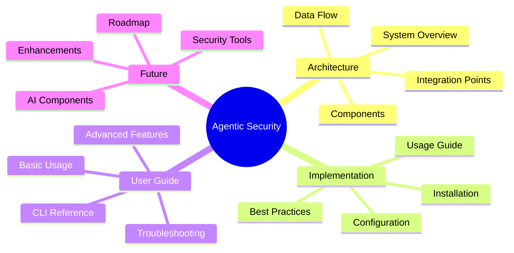

# Agentic Security Documentation

Welcome to the comprehensive documentation for Agentic Security. This documentation is organized into several sections for easy navigation.

## Documentation Sections

### 🏗️ [Architecture](architecture/README.md)
- [System Overview](architecture/overview.md)
- [Data Flow](architecture/data-flow.md)
- [Components](architecture/components.md)
- [Integration Points](architecture/integration.md)

### 🛠️ [Implementation](implementation/README.md)
- [Installation Guide](implementation/installation.md)
- [Configuration Guide](implementation/configuration.md)
- [Usage Guide](implementation/usage.md)
- [Best Practices](implementation/best-practices.md)

### 📚 [User Guide](user-guide/README.md)
- [Getting Started](user-guide/getting-started.md)
- [Advanced Usage](user-guide/advanced-usage.md)
- [Troubleshooting](user-guide/troubleshooting.md)
- [CLI Reference](user-guide/cli-reference.md)
- [Ethical Guidelines](user-guide/ethical-guidelines.md)

### 🚀 [Future Enhancements](future/README.md)
- [Roadmap](future/roadmap.md)
- [Planned Features](future/planned-features.md)
- [AI Components](future/ai-components.md)
- [Security Tools](future/security-tools.md)

## Quick Links

- [Main README](../README.md)
- [GitHub Repository](https://github.com/ruvnet/agentic-security)
- [Issue Tracker](https://github.com/ruvnet/agentic-security/issues)
- [Contributing Guide](../CONTRIBUTING.md)
- [Code of Conduct](../CODE_OF_CONDUCT.md)
- [Security Patterns Guide](implementation/security-patterns.md)
- [AI Integration Guide](implementation/ai-integration.md)

## Key Features

- Dual AI model support (GPT-4 and Claude-3)
- Comprehensive vulnerability scanning
- Pattern-based code analysis
- Automated fix validation
- Smart PR generation
- Multi-tool security integration

## Documentation Updates

This documentation is continuously updated. Check the [changelog](../CHANGELOG.md) for recent changes.
