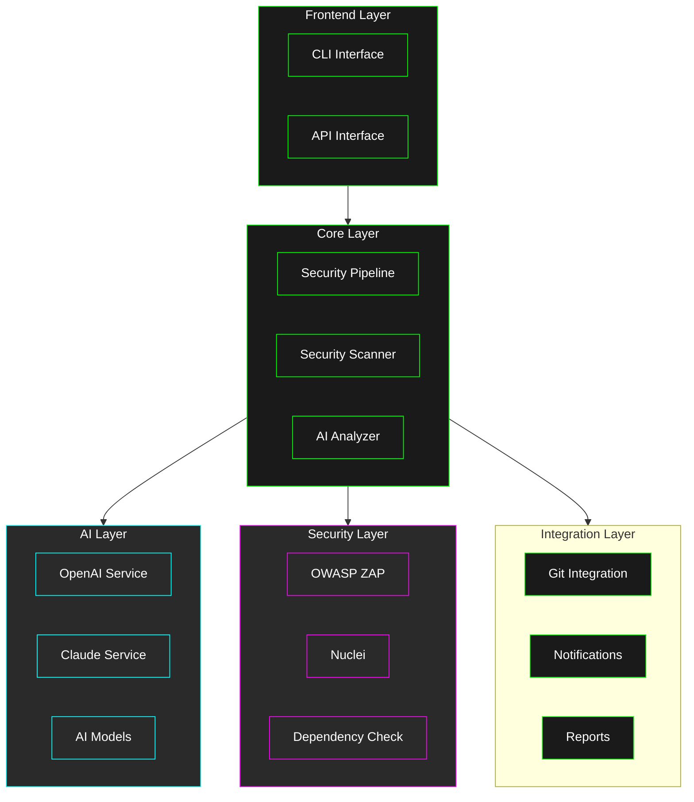
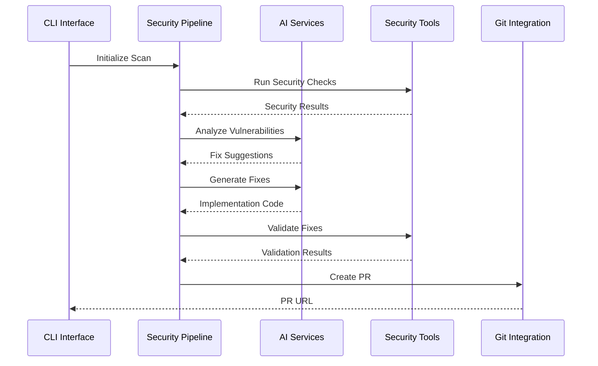
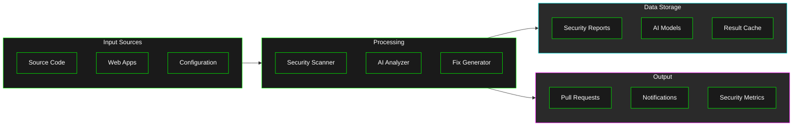
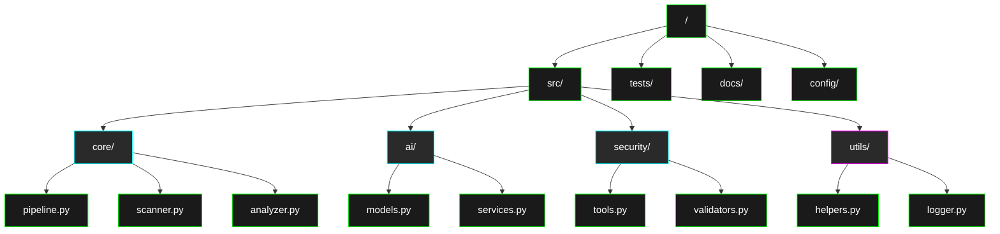

# Architecture Overview

## System Architecture

## Component Interaction

## Data Flow

## Directory Structure

## Further Reading

- [Data Flow Details](data-flow.md)
- [Component Details](components.md)
- [Integration Details](integration.md)
- [Implementation Guide](../implementation/README.md)
