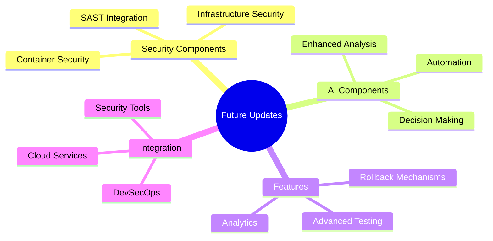

# Future Enhancements

This section outlines planned enhancements and future development roadmap for Agentic Security.

## Implemented Features

Recent implementations include:
- Dual AI model support (GPT-4 and Claude-3)
- Pattern-based vulnerability detection
- Performance-optimized caching system
- Comprehensive review system
- GitHub Actions integration
- Docker container support

## Next Steps

Upcoming enhancements:
- Real-time vulnerability monitoring
- Machine learning-based pattern detection
- Enhanced fix validation system
- Cloud security integration
- Additional AI model support

## Overview



## Planned Components

### Security Components

#### Advanced Vulnerability Assessment
- **SAST (Static Application Security Testing)**
  - SonarQube integration
  - Checkmarx integration
  - Code quality analysis
  - Security anti-patterns detection

#### Container Security
- **Container Scanning**
  - Trivy integration
  - Snyk vulnerability assessment
  - Docker image security checks
  - Container runtime security

#### Infrastructure Security
- **Infrastructure Scanning**
  - Terraform security scanning
  - Cloud configuration analysis
    - AWS Config integration
    - Azure Policy integration
  - Infrastructure as Code security checks

### AI Components

#### Enhanced AI Analysis
- **Advanced Analysis**
  - Vector embeddings for vulnerability pattern matching
  - Semantic code analysis using LLMs
  - Historical vulnerability correlation
  - Pattern recognition improvements
  - Multi-model orchestration
  - Automated fix validation
  - Smart PR description generation
  - Context-aware fix suggestions

#### AI-Driven Decision Making
- **Intelligent Decisions**
  - Risk scoring using machine learning
  - Automated triage of vulnerabilities
  - Prediction of potential security impacts
  - Contextual analysis

### Automation Features

#### Rollback Mechanisms
- **Safety Features**
  - Automated rollback for failed fixes
  - Version control integration
  - State management
  - Recovery procedures

#### Advanced Testing
- **Comprehensive Testing**
  - Fuzzing integration
  - Chaos engineering tests
  - Performance impact analysis
  - Security regression testing

#### Reporting and Analytics
- **Enhanced Insights**
  - Security metrics dashboard
  - Trend analysis
  - Compliance reporting
  - Custom reporting

### Integration Points

#### Security Tools
- **Tool Integration**
  - Burp Suite integration
  - Metasploit for exploit verification
  - Nessus vulnerability scanning
  - Custom tool support

#### DevSecOps Pipeline
- **Pipeline Enhancement**
  - GitOps integration
  - Artifact signing
  - Supply chain security
  - CI/CD security

## Implementation Timeline

```mermaid
gantt
    title Implementation Roadmap
    dateFormat  YYYY-Q%q
    
    section Security
    SAST Integration       :2024-Q2, 90d
    Container Security     :2024-Q3, 90d
    Infrastructure Security:2024-Q4, 90d

    section AI
    Enhanced Analysis      :2024-Q2, 120d
    Decision Making        :2024-Q3, 90d
    Automation            :2024-Q4, 90d

    section Features
    Rollback Mechanisms   :2024-Q2, 60d
    Advanced Testing      :2024-Q3, 90d
    Analytics            :2024-Q4, 90d

    section Integration
    Security Tools        :2024-Q2, 120d
    DevSecOps Pipeline    :2024-Q3, 90d
    Cloud Services        :2024-Q4, 90d
```

## Contributing

We welcome contributions to help implement these features. See our [Contributing Guide](../../CONTRIBUTING.md) for details on how to get involved.
