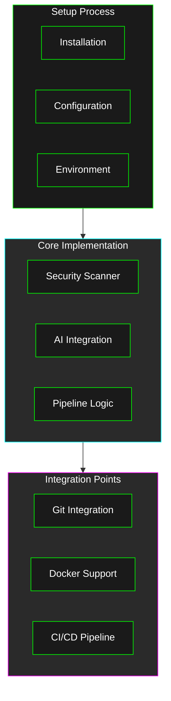
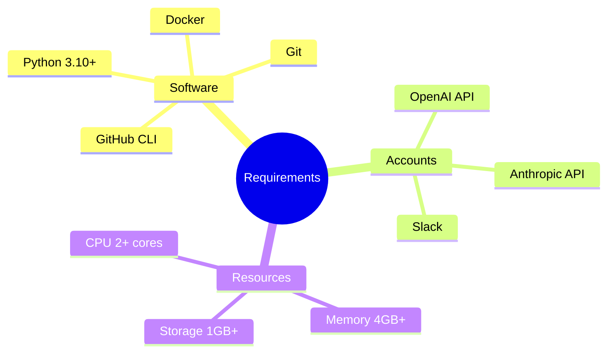
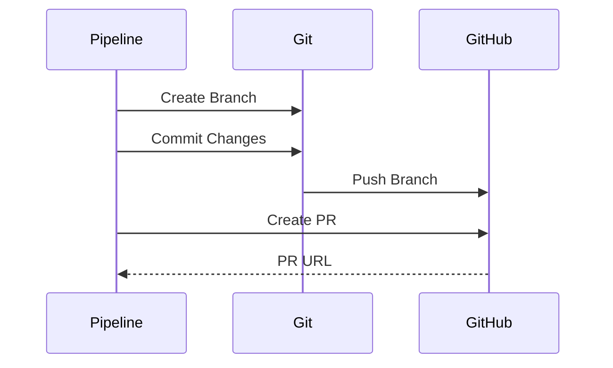
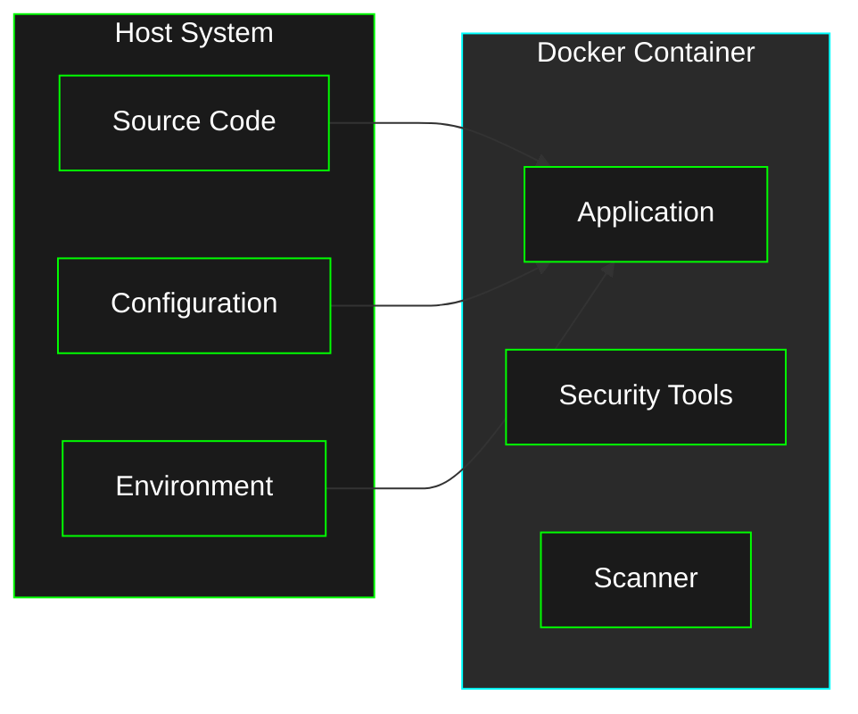

# Implementation Guide

This guide covers the implementation details of Agentic Security, including installation, configuration, and best practices.

## Implementation Overview



## Installation Process

### System Requirements



### Installation Steps

1. **Clone Repository**
   ```bash
   git clone https://github.com/ruvnet/agentic-security.git
   cd agentic-security
   ```

2. **Run Installation Script**
   ```bash
   chmod +x install.sh
   ./install.sh
   ```

3. **Configure Environment**
   ```bash
   cp .env.example .env
   # Edit .env with your API keys
   ```

4. **Verify Installation**
   ```bash
   source venv/bin/activate
   agentic-security version
   ```

## Configuration

### Environment Variables

Required environment variables:
```bash
# OpenAI API Key
OPENAI_API_KEY=your_openai_api_key

# Anthropic API Key
ANTHROPIC_API_KEY=your_anthropic_api_key

# Slack Webhook URL
SLACK_WEBHOOK=https://hooks.slack.com/services/your/webhook/url
```

### Configuration File (config.yml)

```yaml
security:
  critical_threshold: 7.0  # Severity threshold for fixes
  max_fix_attempts: 3      # Maximum automated fix attempts
  scan_targets:
    - type: web
      url: http://localhost:8080
    - type: code
      path: ./src

ai:
  models:
    architecture_review: gpt-4-1106-preview
    fix_implementation: claude-3-sonnet-20240229
  
security_patterns:
  sql_injection:
    - "SELECT * FROM"
    - "INSERT INTO"
    - "UPDATE"
    - "DELETE FROM"
    - "f\"SELECT"
  command_injection:
    - "os.system"
    - "subprocess.call"
    - "eval("
    - "exec("
  xss:
    - "<script>"
    - "innerHTML"
    - "document.write"
  crypto:
    - "md5"
    - "sha1"
    - "DES"
    - "RC4"

notifications:
  enabled: true
  channels:
    - type: github
    - type: slack
      webhook: ${SLACK_WEBHOOK}

aider:
  architect_mode: true
  model: o1-preview
  fix_mode: sonnet
```

## Integration Points

### Git Integration



### Docker Integration



## Best Practices

### Security

1. **API Key Management**
   - Use environment variables
   - Never commit secrets
   - Rotate keys regularly

2. **Access Control**
   - Implement least privilege
   - Use role-based access
   - Regular access review

3. **Data Protection**
   - Encrypt sensitive data
   - Secure communication
   - Data retention policies

### Performance

1. **Resource Management**
   - Optimize scan targets
   - Configure timeouts
   - Monitor resource usage

2. **Caching**
   - Cache scan results
   - Cache AI responses
   - Regular cache cleanup

3. **Parallel Processing**
   - Parallel scanning
   - Async operations
   - Resource pooling

## Troubleshooting

Common issues and solutions:

1. **Installation Issues**
   - Check Python version
   - Verify dependencies
   - Check permissions

2. **Configuration Issues**
   - Validate config.yml
   - Check environment variables
   - Verify API keys

3. **Runtime Issues**
   - Check logs
   - Verify connectivity
   - Monitor resources

## Further Reading

- [Architecture Guide](../architecture/README.md)
- [User Guide](../user-guide/README.md)
- [Future Enhancements](../future/README.md)
