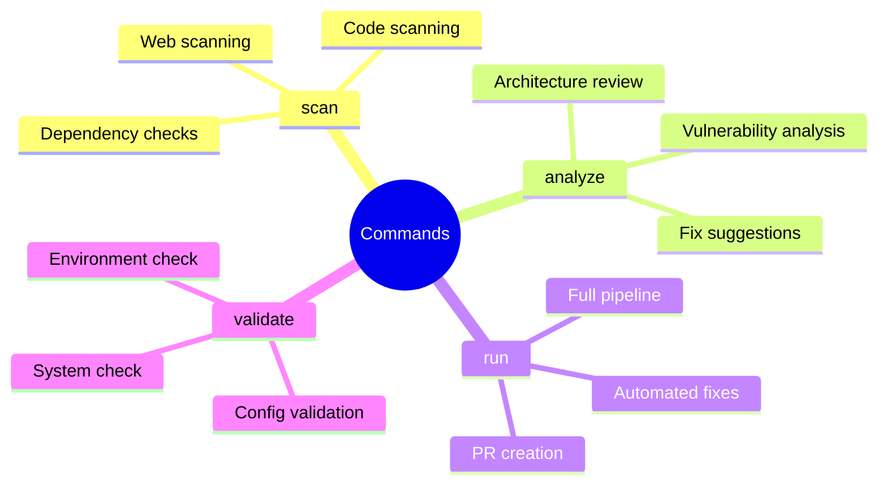
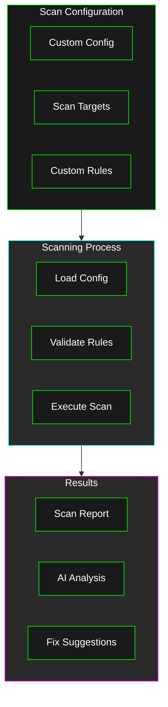
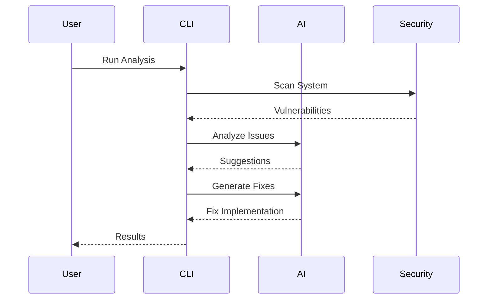

# User Guide

Welcome to the Agentic Security user guide. This guide covers everything from basic usage to advanced features.

## Command Overview



## Basic Usage

### CLI Interface

The CLI provides a cyberpunk-themed interface with advanced scanning options:

#### Basic Commands

```bash
╔══════════════════════════════════════════════════════════════╗
║                     Available Commands                      ║
╚══════════════════════════════════════════════════════════════╝

[>] scan     - Run security scans
[>] analyze  - AI-powered analysis
[>] run      - Full pipeline execution
[>] validate - Config validation
[>] version  - Show version
```

### Common Commands

1. **Run Security Scan**
   ```bash
   agentic-security scan --config config.yml
   ```

2. **Analyze Security Issues**
   ```bash
   agentic-security analyze --config config.yml
   ```

3. **Run Full Pipeline**
   ```bash
   # Full pipeline with architecture review
   agentic-security run --config config.yml --with-architecture-review

   # Skip architecture review
   agentic-security run --config config.yml --skip-architecture-review

   # Custom model selection
   agentic-security run --config config.yml --arch-model gpt-4 --fix-model claude-3
   ```

## Advanced Features

### Custom Scanning



### AI Integration



## Ethical Guidelines

### Responsible Usage

1. **Consent and Authorization**
   - Only scan authorized systems
   - Respect system boundaries
   - Follow security policies

2. **Data Protection**
   - Handle data responsibly
   - Protect sensitive information
   - Follow privacy guidelines

3. **AI Usage**
   - Review AI suggestions
   - Validate automated fixes
   - Monitor AI behavior

### Best Practices

1. **Scanning**
   - Regular scanning schedule
   - Comprehensive coverage
   - Resource consideration

2. **Analysis**
   - Thorough review
   - Context consideration
   - Impact assessment

3. **Implementation**
   - Careful validation
   - Staged deployment
   - Rollback planning

## Troubleshooting

### Common Issues

1. **Scan Failures**
   ```bash
   # Check scan status
   agentic-security validate --config config.yml
   
   # Review logs
   cat logs/security_scan.log
   ```

2. **AI Integration Issues**
   ```bash
   # Verify API keys
   agentic-security validate --check-api
   
   # Test AI connection
   agentic-security analyze --test-ai
   ```

3. **Pipeline Issues**
   ```bash
   # Check pipeline status
   agentic-security run --dry-run
   
   # Validate configuration
   agentic-security validate --full
   ```

## Configuration

### Advanced Settings

```yaml
security:
  # Custom scan settings
  scan_depth: comprehensive
  custom_rules: path/to/rules
  
  # AI settings
  ai_confidence_threshold: 0.85
  max_suggestions: 5
  
  # Pipeline settings
  parallel_scans: true
  cache_results: true
```

## Further Reading

- [Architecture Guide](../architecture/README.md)
- [Implementation Guide](../implementation/README.md)
- [Future Enhancements](../future/README.md)
